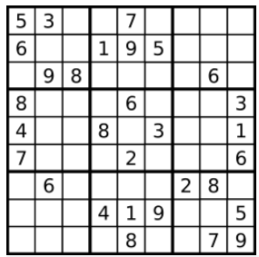

请你判断一个`9 x 9`的数独是否有效。只需要**根据以下规则**，验证已经填入的数字是否有效即可。
1. 数字`1-9`在每一行只能出现一次。
2. 数字`1-9`在每一列只能出现一次。
3. 数字`1-9`在每一个以粗实线分隔的`3x3`宫内只能出现一次。（请参考示例图）

注意：
一个有效的数独（部分已被填充）不一定是可解的。
只需要根据以上规则，验证已经填入的数字是否有效即可。
空白格用 '.' 表示。

# 解题思路

